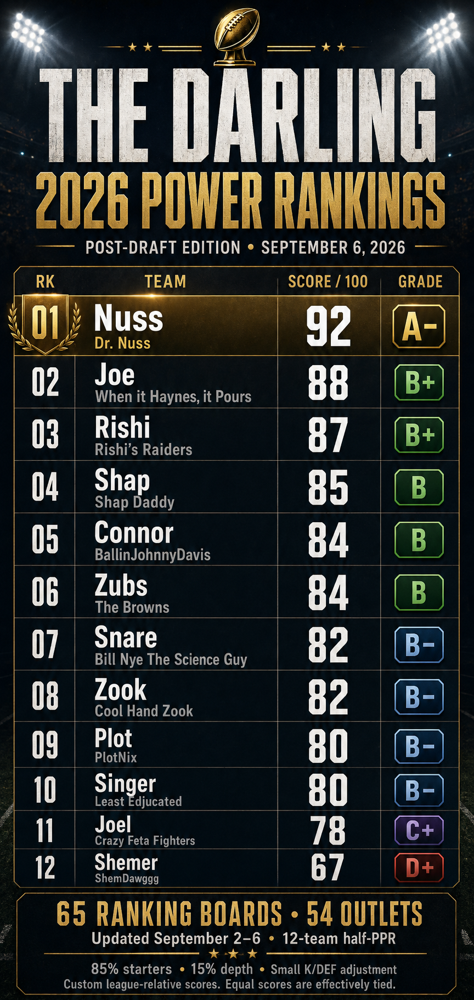

# Darling 2026 post-draft power rankings

[Download graphic](2026-post-draft-power-rankings.png) · [Supporting data](2026-post-draft-power-rankings-data.json) · [Image-generation prompt](2026-post-draft-power-rankings-graphic-prompt.txt)

As of September 6, 2026. Rankings window: September 2–6, inclusive (five calendar dates, Eastern time).

**Nuss ranks first, followed by Joe, Rishi and Shap.** This is a season-long assessment of the drafted rosters; the scores are a custom league-relative index, not win probabilities, projected points, or publisher-issued draft grades.

The core calculation uses **65 dated half-PPR ranking boards from 54 outlet labels**, comprising 21,575 ranking rows before filtering positions. Individual boards were downloaded and their displayed dates checked. One board is a community consensus. These are not 65 statistically independent forecasts.

[Draft board](https://sleeper.com/draft/nfl/1386757318691004416) · [Draft picks API](https://api.sleeper.app/v1/draft/1386757318691004416/picks) · [League settings API](https://api.sleeper.app/v1/league/1386757318678433792)

League settings verified: 12 teams; 0.5 points per reception; 4 points per passing touchdown; 1 QB, 2 RB, 2 WR, 1 TE, 1 RB/WR/TE flex, 1 K, 1 DEF, 7 bench. Kicker scoring includes 0.1 points per field-goal yard and distance-dependent miss penalties. Generic kicker ranks approximate this custom setting; their score impact is small.

| Rank | Manager / team | Score | Grade | Strength | Concern |
|---:|---|---:|:---:|---|---|
| 1 | **Nuss — Dr. Nuss** | 92/100 | **A-** | Gibbs + Bowers create the biggest combined RB/TE advantage. London, McMillan and Evans fill out a strong receiving lineup. | Jadarian Price is the vulnerable RB2; the bench offers less cover than several rivals. Replace unsigned Justin Tucker. |
| 2 | **Joe — When it Haynes, it Pours** | 88/100 | **B+** | McCaffrey, Jeanty and McBride give this lineup three premium anchors, with Hurts and Rice adding strength. | The WR2/flex spots depend on Burden and Metcalf; the bench is adequate rather than dominant. |
| 3 | **Rishi — Rishi’s Raiders ☠️** | 87/100 | **B+** | Cook, A.J. Brown, Maye and Loveland make a balanced core. Etienne/Montgomery and useful receiving reserves limit weak spots. | Brian Thomas is the least secure starting receiver; there is less elite RB/TE value than on the top two rosters. |
| 4 | **Shap — Shap Daddy** | 85/100 | **B** | Chase and Collins form an excellent WR pairing; Burrow, Kyren and Swift round out a strong core. Pollard and Pittman provide usable depth. | The Pitts/Tate end of the starting lineup carries less consensus value than the higher-ranked teams’ equivalent spots. |
| 5 | **Connor — BallinJohnnyDavis** | 84/100 | **B** | Lamb, Nabers and DeVonta Smith give this roster an outstanding three-WR lineup, supported by Chase Brown. | Tuten at RB2 and Kincaid at TE leave two clear pressure points. Nabers’ recovery adds uncertainty already reflected in the recent boards. |
| 6 | **Zubs — The Browns** | 84/100 | **B** | Amon-Ra, Jefferson and Higgins are an elite starting WR trio; Parker Washington is valuable cover. | Jeremiyah Love and MarShawn Lloyd carry the starting-RB burden. RB depth has less established consensus value than the receivers. |
| 7 | **Snare — Bill Nye The Science Guy** | 82/100 | **B-** | Bijan, Pickens, Flowers and Daniels provide a strong core, with Bucky Irving and DJ Moore filling out a competitive lineup. | Jacobs is an uncertain stash, not a dependable starting RB. Kittle’s recovery and thinner usable reserves keep the floor below the top tier. |
| 8 | **Zook — Cool Hand Zook 🔫** | 82/100 | **B-** | Taylor, Walker and Hall form the deepest starting RB trio, and this roster has the model’s strongest bench. | Goedert provides little TE advantage; the starting receivers offer less top-end value. Extra bench weight moves this roster up. |
| 9 | **Plot — PlotNix** | 80/100 | **B-** | Puka and Josh Allen deliver elite WR/QB anchors. Javonte and Judkins form a serviceable RB pair. | The remainder of the lineup lacks another premium anchor; reserve RB support is particularly thin behind the starters. |
| 10 | **Singer — Least Edjucated** | 80/100 | **B-** | JSN and Henry anchor a competitive WR-heavy roster; Wilson, Egbuka and Sutton provide useful options. | The Nix/Stafford QB pairing and Stevenson at RB2 offer less weekly advantage. The RB bench is not a major strength. |
| 11 | **Joel — Crazy Feta Fighters** | 78/100 | **C+** | Achane, Hampton and Olave are a strong trio, with Henderson, Warren and Hubbard providing RB options. | The Mahomes/Goff pairing ranks lower than most league quarterbacks, and WR depth is less convincing. A defense must be added. |
| 12 | **Shemer — ShemDawggg** | 67/100 | **D+** | Lamar and Barkley are strong anchors, and McConkey/McLaurin are credible starting receivers. | The largest gap is usable flex and bench strength: Lemon, Jones and Worthy trail rivals’ alternatives. Three TEs, two QBs and an early kicker leave fewer RB/WR options. |

Scores are rounded to whole numbers; ordering uses unrounded values. Connor/Zubs, Zook/Snare and Plot/Singer are effectively tied. Small gaps should not be interpreted as meaningful forecast certainty.

## Availability checks

- **Josh Jacobs:** September 4 reporting confirms he is on the Commissioner’s Exempt List and cannot play or practice. The return date is uncertain; the blended rankings place him approximately 137th among skill players. He is treated as a bench stash. [NFL/AP report](https://amp.nfl.com/news/packers-rb-josh-jacobs-initial-court-appearance-moved-up-to-sept-10).
- **Justin Tucker:** the September 2 Jets workout did not result in a signing in the reporting retrieved. He receives no current starting-kicker credit. This is a readily fixable roster gap for Nuss. [RotoWire update](https://www.rotowire.com/football/headlines/justin-tucker-news-gets-tryout-with-jets-636027).
- **Joel:** no defense appears among his 16 draft picks. The scoring reflects the empty drafted slot.
- Other health uncertainties are reflected through current rankings; no additional blanket injury deductions were applied. This avoids deducting twice for the same concern. A new injury or availability update can change the ordering.

## Scoring method

1. Retain dated 2026 draft, half-PPR, overall boards from September 2–6. Do not substitute dynasty, superflex or weekly rankings. Do not use the unfiltered FantasyPros headline consensus, which includes older boards.
2. Match player names to all 192 Sleeper picks, normalizing punctuation and suffixes. Remove kickers/defenses and re-index each board’s QB/RB/WR/TE order so different special-team draft conventions do not distort comparisons. Missing skill players receive rank max(201, number of skill players in that board + 1).
3. For each player, calculate the median skill rank within each outlet, then the median across outlets. This limits the influence of publishers with multiple analysts and reduces outlier effects. The outlet labels are as supplied by FantasyPros; separate labels can still be affiliated or correlated.
4. Convert each blended skill rank r into diminishing value: V = max(0, ln(301 / (r + 10))). This is a heuristic value curve, not a points projection. Choose the best legal seven-player skill lineup for each roster using these values. Starter strength S is the sum of its seven values.
5. Discount reserve QBs and TEs to 40% of V in this one-QB, one-TE format. Sort bench players by adjusted value, and weight the first through seventh reserves by 1.00, 0.80, 0.60, 0.40, 0.20, 0.10 and 0.05. Their weighted sum is depth D. This rewards useful cover more than redundant reserves.
6. Standardize S and D across the 12 teams using population standard deviations. Compute C = 0.85 × z(S) + 0.15 × z(D), then standardize C. This makes starters the primary driver.
7. Use the same outlet-balanced positional median for K and DEF. Boards that do not rank that position are omitted for that position. If a board ranks the position but omits the drafted player, assign positional rank 33. Position credit is max(0, 1 − (position rank − 1)/24); an empty drafted slot receives zero. Let KDEF be the two-position average.
8. Final score = clamp(82 + 6 × z(C) + 2 × (KDEF − 0.5), 0, 100). The mean/scale are editorial calibration choices for this league; special teams can move the score at most one point either way. Round to whole numbers for presentation. No draft-slot or pick-value bonus enters the power score.

Grade cutoffs on the displayed score: A+ 97; A 93; A− 90; B+ 87; B 83; B− 80; C+ 77; C 73; C− 70; D+ 67; D 63; D− 60; F below 60.

## Sensitivity and checks

Varying starter weight between 75%, 80%, 85% and 90% preserves the top four in order: Nuss, Joe, Rishi, Shap. Joel remains 11th and Shemer 12th. The middle changes slightly; Zook particularly benefits from stronger bench weighting. This tests one methodological choice, not all possible scoring methods, and is not a statistical confidence interval.

All 192 drafted player names match uniquely. Each team has exactly 16 picks and a legal seven-player skill lineup. All included ranking boards passed rank-order and duplicate-rank checks. Low-coverage players are reserve options: Jordan James, Seth McGowan, Cyrus Allen and Isiah Pacheco.

## Team lineup detail

Numbers in parentheses are the custom blended skill-only overall ranks, not draft positions or FantasyPros ECR. The lineup is optimized for season-long value, not a Week 1 start/sit recommendation.

### 1. Nuss — 92/100, A-

Team: Dr. Nuss. Draft slot: 1.

Core lineup: Caleb Williams (QB, 68.5); Jahmyr Gibbs (RB, 1); Jadarian Price (RB, 60); Drake London (WR, 18); Tetairoa McMillan (WR, 39.5); Brock Bowers (TE, 17); Mike Evans (WR, 61.5).

Bench, in model depth order: Kenny Gainwell (RB, 104); Wan'Dale Robinson (WR, 106); Kyle Monangai (RB, 116); Tre Tucker (WR, 157.5); Braelon Allen (RB, 161); Brock Purdy (QB, 97); Mark Andrews (TE, 128).

### 2. Joe — 88/100, B+

Team: When it Haynes, it Pours. Draft slot: 5.

Core lineup: Jalen Hurts (QB, 58.5); Christian McCaffrey (RB, 7.5); Ashton Jeanty (RB, 24.5); Rashee Rice (WR, 31); Luther Burden (WR, 47); Trey McBride (TE, 22); DK Metcalf (WR, 77.5).

Bench, in model depth order: J.K. Dobbins (RB, 93); Michael Wilson (WR, 94); Rachaad White (RB, 116); Kayshon Boutte (WR, 163); Kaelon Black (RB, 190.5); Jaxson Dart (QB, 100); Seth McGowan (RB, 225.5).

### 3. Rishi — 87/100, B+

Team: Rishi’s Raiders ☠️. Draft slot: 9.

Core lineup: Drake Maye (QB, 43.5); James Cook (RB, 9.25); Travis Etienne (RB, 43); A.J. Brown (WR, 15); Brian Thomas (WR, 79); Colston Loveland (TE, 34); David Montgomery (RB, 55).

Bench, in model depth order: Rico Dowdle (RB, 81.5); Quentin Johnston (WR, 89); Josh Downs (WR, 95); Rashid Shaheed (WR, 140); Ray Davis (RB, 171.5); Malik Willis (QB, 131); Jordan James (RB, 229).

### 4. Shap — 85/100, B

Team: Shap Daddy. Draft slot: 7.

Core lineup: Joe Burrow (QB, 53); Kyren Williams (RB, 33); D'Andre Swift (RB, 45.25); Ja'Marr Chase (WR, 3); Nico Collins (WR, 19); Kyle Pitts (TE, 84); Carnell Tate (WR, 74).

Bench, in model depth order: Tony Pollard (RB, 77); Michael Pittman (WR, 92); Matthew Golden (WR, 120.75); Khalil Shakir (WR, 135); Dylan Sampson (RB, 149.5); Tyrone Tracy (RB, 163.25); Pat Bryant (WR, 177).

### 5. Connor — 84/100, B

Team: BallinJohnnyDavis. Draft slot: 12.

Core lineup: Justin Herbert (QB, 71); Chase Brown (RB, 13.5); Bhayshul Tuten (RB, 59.5); CeeDee Lamb (WR, 10); Malik Nabers (WR, 27.5); Dalton Kincaid (TE, 109); DeVonta Smith (WR, 29).

Bench, in model depth order: Blake Corum (RB, 89); Jayden Reed (WR, 101.5); Jacory Croskey-Merritt (RB, 102); Tyler Allgeier (RB, 131.25); Deebo Samuel (WR, 133.5); Zachariah Branch (WR, 201); Cyrus Allen (WR, 202.5).

### 6. Zubs — 84/100, B

Team: The Browns. Draft slot: 4.

Core lineup: Dak Prescott (QB, 78); Jeremiyah Love (RB, 37); MarShawn Lloyd (RB, 82); Amon-Ra St. Brown (WR, 6.5); Justin Jefferson (WR, 11); Sam LaPorta (TE, 78.75); Tee Higgins (WR, 35.5).

Bench, in model depth order: Parker Washington (WR, 59); RJ Harvey (RB, 98.5); KC Concepcion (WR, 119.5); Chris Rodriguez (RB, 120.5); Keaton Mitchell (RB, 143.5); Jordan Love (QB, 120); Devaughn Vele (WR, 210).

### 7. Snare — 82/100, B-

Team: Bill Nye The Science Guy. Draft slot: 2.

Core lineup: Jayden Daniels (QB, 62); Bijan Robinson (RB, 2); Bucky Irving (RB, 52); George Pickens (WR, 22.75); Zay Flowers (WR, 31); George Kittle (TE, 94); DJ Moore (WR, 54).

Bench, in model depth order: Stefon Diggs (WR, 96); Woody Marks (RB, 129); Josh Jacobs (RB, 136.5); Brian Robinson (RB, 158); Alvin Kamara (RB, 164.75); Omar Cooper (WR, 177.5); Isaiah Likely (TE, 111.5).

### 8. Zook — 82/100, B-

Team: Cool Hand Zook 🔫. Draft slot: 8.

Core lineup: Trevor Lawrence (QB, 73); Jonathan Taylor (RB, 8); Kenneth Walker (RB, 17); Jaylen Waddle (WR, 38); Christian Watson (WR, 54); Dallas Goedert (TE, 115); Breece Hall (RB, 38.5).

Bench, in model depth order: Rome Odunze (WR, 59); Jonathon Brooks (RB, 79); Chris Godwin (WR, 81); De'Zhaun Stribling (WR, 114); Jonah Coleman (RB, 140.5); Caleb Douglas (WR, 192.25); Isiah Pacheco (RB, 201.5).

### 9. Plot — 80/100, B-

Team: PlotNix. Draft slot: 3.

Core lineup: Josh Allen (QB, 25); Javonte Williams (RB, 35.75); Quinshon Judkins (RB, 55); Puka Nacua (WR, 4); Davante Adams (WR, 48); Harold Fannin (TE, 84); Marvin Harrison (WR, 73).

Bench, in model depth order: Alec Pierce (WR, 94.5); Jakobi Meyers (WR, 116.5); Romeo Doubs (WR, 127); Jalen Coker (WR, 133); Mike Washington (RB, 140); Emmett Johnson (RB, 160.5); Jalen Nailor (WR, 176).

### 10. Singer — 80/100, B-

Team: Least Edjucated. Draft slot: 11.

Core lineup: Bo Nix (QB, 99.5); Derrick Henry (RB, 20); Rhamondre Stevenson (RB, 67); Jaxon Smith-Njigba (WR, 6); Garrett Wilson (WR, 38); Tyler Warren (TE, 56); Emeka Egbuka (WR, 42.5).

Bench, in model depth order: Courtland Sutton (WR, 83); Jordan Mason (RB, 98); Tyjae Spears (RB, 138); Zach Charbonnet (RB, 146); Ja'Kobi Lane (WR, 183.5); Matthew Stafford (QB, 107.5); Hunter Henry (TE, 155.5).

### 11. Joel — 78/100, C+

Team: Crazy Feta Fighters. Draft slot: 10.

Core lineup: Patrick Mahomes (QB, 103); De'Von Achane (RB, 17); Omarion Hampton (RB, 18); Chris Olave (WR, 22.5); Jameson Williams (WR, 49.5); Tucker Kraft (TE, 66); TreVeyon Henderson (RB, 65).

Bench, in model depth order: Jaylen Warren (RB, 71); Chuba Hubbard (RB, 96.5); Jordan Addison (WR, 106); Jordyn Tyson (WR, 139); Denzel Boston (WR, 154.5); Keenan Allen (WR, 174.5); Jared Goff (QB, 106.25); Juwan Johnson (TE, 128).

### 12. Shemer — 67/100, D+

Team: ShemDawggg. Draft slot: 6.

Core lineup: Lamar Jackson (QB, 35.5); Saquon Barkley (RB, 15); Cam Skattebo (RB, 52); Ladd McConkey (WR, 39); Terry McLaurin (WR, 48.5); Travis Kelce (TE, 105); Makai Lemon (WR, 109).

Bench, in model depth order: Aaron Jones (RB, 119); Xavier Worthy (WR, 126.5); Tank Bigsby (RB, 150); Malik Washington (WR, 181.5); Kyler Murray (QB, 112); Jake Ferguson (TE, 130); Oronde Gadsden (TE, 198.75).

## Included source manifest

Displayed dates below come from the retrieved individual board headings. Live URLs and search-engine caches may subsequently show different dates or rankings.

| Outlet | Analyst / board | Displayed update | Players |
|---|---|---|---:|
| BA Sports Podcast | [Brady Auer](https://www.fantasypros.com/nfl/rankings/bradyauer.php?type=draft&scoring=HALF&position=ALL) | Sep 2, 2026 | 210 |
| Bandit Fantasy Football | [Brad Beatson](https://www.fantasypros.com/nfl/rankings/bandit.php?type=draft&scoring=HALF&position=ALL) | Sep 3, 2026 | 206 |
| BettingPros | [Mike Maher](https://www.fantasypros.com/nfl/rankings/mike-maher.php?type=draft&scoring=HALF&position=ALL) | Sep 3, 2026 | 261 |
| Cam Sheath Fantasy Football Blog | [Cameron Sheath](https://www.fantasypros.com/nfl/rankings/cameron-sheath.php?type=draft&scoring=HALF&position=ALL) | Sep 2, 2026 | 278 |
| Chop Fantasy Football | [Owen MacCarrick](https://www.fantasypros.com/nfl/rankings/owen-maccarrick.php?type=draft&scoring=HALF&position=ALL) | Sep 3, 2026 | 340 |
| Club Fantasy FFL | [Ryan Weisse](https://www.fantasypros.com/nfl/rankings/ryan-weisse.php?type=draft&scoring=HALF&position=ALL) | Sep 6, 2026 | 369 |
| Cupps Analytics | [Alex Cupps](https://www.fantasypros.com/nfl/rankings/alex-cupps.php?type=draft&scoring=HALF&position=ALL) | Sep 5, 2026 | 282 |
| DFS Dashboard | [Matthew Korn](https://www.fantasypros.com/nfl/rankings/matthewkorn.php?type=draft&scoring=HALF&position=ALL) | Sep 4, 2026 | 356 |
| Dime Projections | [Michael Stevi](https://www.fantasypros.com/nfl/rankings/michael-stevi---dime-projections.php?type=draft&scoring=HALF&position=ALL) | Sep 6, 2026 | 268 |
| Dr. Roto | [Chris Kennedy](https://www.fantasypros.com/nfl/rankings/chris-kennedy.php?type=draft&scoring=HALF&position=ALL) | Sep 4, 2026 | 630 |
| Dr. Roto | [Matt De Lima](https://www.fantasypros.com/nfl/rankings/matt-de-lima.php?type=draft&scoring=HALF&position=ALL) | Sep 4, 2026 | 384 |
| Dynasty Trade Calculator | [David Heilman](https://www.fantasypros.com/nfl/rankings/david-heilman.php?type=draft&scoring=HALF&position=ALL) | Sep 6, 2026 | 200 |
| Estadio Fantasy | [Mauricio Gutierrez](https://www.fantasypros.com/nfl/rankings/mauricio-gutierrez.php?type=draft&scoring=HALF&position=ALL) | Sep 2, 2026 | 313 |
| Fantasy Endgame | [Pierre Camus](https://www.fantasypros.com/nfl/rankings/pierre-camus.php?type=draft&scoring=HALF&position=ALL) | Sep 5, 2026 | 336 |
| Fantasy Football Bots | [Ted Chmyz](https://www.fantasypros.com/nfl/rankings/tedchmyz.php?type=draft&scoring=HALF&position=ALL) | Sep 4, 2026 | 357 |
| Fantasy Football Diagnostics | [Jon Jeune](https://www.fantasypros.com/nfl/rankings/jon-jeune.php?type=draft&scoring=HALF&position=ALL) | Sep 6, 2026 | 249 |
| Fantasy Football Empire | [Jeff Boggis](https://www.fantasypros.com/nfl/rankings/jeff-boggis.php?type=draft&scoring=HALF&position=ALL) | Sep 4, 2026 | 277 |
| Fantasy Football Universe | [Jeremy Shulman](https://www.fantasypros.com/nfl/rankings/jeremy-shulman.php?type=draft&scoring=HALF&position=ALL) | Sep 3, 2026 | 335 |
| Fantasy Futebolista | [Guilherme Gianni](https://www.fantasypros.com/nfl/rankings/guilherme-gianni-.php?type=draft&scoring=HALF&position=ALL) | Sep 4, 2026 | 323 |
| Fantasy In Frames | [Aidan Weingartner](https://www.fantasypros.com/nfl/rankings/aidanweingartner.php?type=draft&scoring=HALF&position=ALL) | Sep 5, 2026 | 306 |
| Fantasy In Frames | [Jorge B. Edwards](https://www.fantasypros.com/nfl/rankings/jorge-b-edwards.php?type=draft&scoring=HALF&position=ALL) | Sep 5, 2026 | 228 |
| Fantasy Shed | [Rich Piazza](https://www.fantasypros.com/nfl/rankings/rich-piazza-fantasy-shed.php?type=draft&scoring=HALF&position=ALL) | Sep 3, 2026 | 339 |
| FantasyNow+ | [Justin Bauerle](https://www.fantasypros.com/nfl/rankings/justinbauerle.php?type=draft&scoring=HALF&position=ALL) | Sep 3, 2026 | 309 |
| FantasyPros | [Andrew Erickson](https://www.fantasypros.com/nfl/rankings/andrew-erickson.php?type=draft&scoring=HALF&position=ALL) | Sep 4, 2026 | 235 |
| FantasyPros | [Chris Welsh](https://www.fantasypros.com/nfl/rankings/christopher-welsh.php?type=draft&scoring=HALF&position=ALL) | Sep 4, 2026 | 314 |
| FantasyPros | [Derek Brown](https://www.fantasypros.com/nfl/rankings/derek-brown.php?type=draft&scoring=HALF&position=ALL) | Sep 5, 2026 | 334 |
| FantasyPros | [Mike Fanelli](https://www.fantasypros.com/nfl/rankings/mike-fanelli.php?type=draft&scoring=HALF&position=ALL) | Sep 5, 2026 | 325 |
| FantasyPros | [Pat Fitzmaurice](https://www.fantasypros.com/nfl/rankings/pat-fitzmaurice.php?type=draft&scoring=HALF&position=ALL) | Sep 5, 2026 | 329 |
| FantasyPros | [Seth Woolcock](https://www.fantasypros.com/nfl/rankings/sethwoolcock.php?type=draft&scoring=HALF&position=ALL) | Sep 6, 2026 | 312 |
| FantasyPros | [Tera Roberts](https://www.fantasypros.com/nfl/rankings/tera-roberts.php?type=draft&scoring=HALF&position=ALL) | Sep 4, 2026 | 338 |
| FantasySharks | [Justin Weigal](https://www.fantasypros.com/nfl/rankings/justin-weigal.php?type=draft&scoring=HALF&position=ALL) | Sep 6, 2026 | 287 |
| Fantrax | [Ryan Prosick](https://www.fantasypros.com/nfl/rankings/ryan-prosick.php?type=draft&scoring=HALF&position=ALL) | Sep 2, 2026 | 302 |
| FF Faceoff | [Pete Nova](https://www.fantasypros.com/nfl/rankings/petenova.php?type=draft&scoring=HALF&position=ALL) | Sep 4, 2026 | 380 |
| FlurrySports | [Trevor Land](https://www.fantasypros.com/nfl/rankings/trevor-land.php?type=draft&scoring=HALF&position=ALL) | Sep 4, 2026 | 318 |
| FTN | [C.H. Herms](https://www.fantasypros.com/nfl/rankings/herms.php?type=draft&scoring=HALF&position=ALL) | Sep 5, 2026 | 317 |
| Going For 2 | [Chew Russell](https://www.fantasypros.com/nfl/rankings/chew-russell.php?type=draft&scoring=HALF&position=ALL) | Sep 4, 2026 | 332 |
| Going For 2 | [Kyle Senra](https://www.fantasypros.com/nfl/rankings/kyle-senra.php?type=draft&scoring=HALF&position=ALL) | Sep 3, 2026 | 287 |
| gregsauce | [Greg Smith](https://www.fantasypros.com/nfl/rankings/greg-smith.php?type=draft&scoring=HALF&position=ALL) | Sep 3, 2026 | 366 |
| Gridiron Experts | [Jason Willan](https://www.fantasypros.com/nfl/rankings/jason-willan.php?type=draft&scoring=HALF&position=ALL) | Sep 3, 2026 | 315 |
| OTC Fantasy | [Frank Ammirante](https://www.fantasypros.com/nfl/rankings/frank-ammirante.php?type=draft&scoring=HALF&position=ALL) | Sep 5, 2026 | 228 |
| Player Profiler | [Wyatt Bertolone](https://www.fantasypros.com/nfl/rankings/wyatt-bertolone.php?type=draft&scoring=HALF&position=ALL) | Sep 3, 2026 | 201 |
| Points Over Expected | [Mike Bland](https://www.fantasypros.com/nfl/rankings/mike-bland.php?type=draft&scoring=HALF&position=ALL) | Sep 6, 2026 | 250 |
| Pressbox | [Ken Zalis](https://www.fantasypros.com/nfl/rankings/ken-zalis.php?type=draft&scoring=HALF&position=ALL) | Sep 6, 2026 | 270 |
| Primero y Diez | [Francisco (Chato) Romero](https://www.fantasypros.com/nfl/rankings/francisco-(chato)-romero.php?type=draft&scoring=HALF&position=ALL) | Sep 2, 2026 | 370 |
| Pro Football Mania | [Justin Fuhr](https://www.fantasypros.com/nfl/rankings/justin-fuhr.php?type=draft&scoring=HALF&position=ALL) | Sep 6, 2026 | 309 |
| ProFootballIntel | [Justin Jaksa](https://www.fantasypros.com/nfl/rankings/justin-r-jaksa.php?type=draft&scoring=HALF&position=ALL) | Sep 5, 2026 | 290 |
| QB List | [Drew DeLuca](https://www.fantasypros.com/nfl/rankings/drew-deluca.php?type=draft&scoring=HALF&position=ALL) | Sep 6, 2026 | 299 |
| r/fantasyfootball | [Community Consensus](https://www.fantasypros.com/nfl/rankings/reddit.php?type=draft&scoring=HALF&position=ALL) | Sep 4, 2026 | 316 |
| Razzball | [Rudy Gamble](https://www.fantasypros.com/nfl/rankings/rudy-gamble.php?type=draft&scoring=HALF&position=ALL) | Sep 5, 2026 | 397 |
| Roto Street Journal | [Wolf of Roto Street](https://www.fantasypros.com/nfl/rankings/wolf-of-roto-street.php?type=draft&scoring=HALF&position=ALL) | Sep 4, 2026 | 267 |
| RotoBaller | [Brandon Murchison](https://www.fantasypros.com/nfl/rankings/brandon-murchison.php?type=draft&scoring=HALF&position=ALL) | Sep 2, 2026 | 298 |
| RotoBaller | [Dan Larocca](https://www.fantasypros.com/nfl/rankings/dan-larocca.php?type=draft&scoring=HALF&position=ALL) | Sep 4, 2026 | 375 |
| RotoBaller | [Kevin Tompkins](https://www.fantasypros.com/nfl/rankings/kevin-tompkins.php?type=draft&scoring=HALF&position=ALL) | Sep 5, 2026 | 260 |
| SB Nation | [Chet Gresham](https://www.fantasypros.com/nfl/rankings/chet-gresham.php?type=draft&scoring=HALF&position=ALL) | Sep 4, 2026 | 309 |
| SharpLinkHQ | [Tommy Garrett](https://www.fantasypros.com/nfl/rankings/tommy-garrett.php?type=draft&scoring=HALF&position=ALL) | Sep 3, 2026 | 397 |
| Stone Cold Fantasy | [Jonathan Stone](https://www.fantasypros.com/nfl/rankings/jonathan-stone.php?type=draft&scoring=HALF&position=ALL) | Sep 6, 2026 | 991 |
| Talking Points Sports | [Ed Birdsall](https://www.fantasypros.com/nfl/rankings/ed-birdsall.php?type=draft&scoring=HALF&position=ALL) | Sep 4, 2026 | 397 |
| The Deep Shot | [Dalton Del Don](https://www.fantasypros.com/nfl/rankings/dalton-del-don.php?type=draft&scoring=HALF&position=ALL) | Sep 6, 2026 | 288 |
| The DFS Build | [Kevin Roberts](https://www.fantasypros.com/nfl/rankings/kevin-roberts.php?type=draft&scoring=HALF&position=ALL) | Sep 3, 2026 | 315 |
| The Fantasy Champions | [Ricky Lemon](https://www.fantasypros.com/nfl/rankings/ricky-lemon.php?type=draft&scoring=HALF&position=ALL) | Sep 3, 2026 | 317 |
| The Fantasy Edge | [Chris Dell](https://www.fantasypros.com/nfl/rankings/christopher-dell.php?type=draft&scoring=HALF&position=ALL) | Sep 4, 2026 | 256 |
| The Fantasy Scout | [Tal Malachovsky](https://www.fantasypros.com/nfl/rankings/tal-malachovsky.php?type=draft&scoring=HALF&position=ALL) | Sep 4, 2026 | 328 |
| The Washington Post | [Des Bieler](https://www.fantasypros.com/nfl/rankings/des-bieler.php?type=draft&scoring=HALF&position=ALL) | Sep 2, 2026 | 314 |
| Wheel Route FF | [Kev Wheeler](https://www.fantasypros.com/nfl/rankings/kevin-wheeler.php?type=draft&scoring=HALF&position=ALL) | Sep 4, 2026 | 332 |
| Yates Fantasy Football | [Kyle Yates](https://www.fantasypros.com/nfl/rankings/kyle-yates.php?type=draft&scoring=HALF&position=ALL) | Sep 2, 2026 | 954 |

## Additional sources screened

| Source | Date observed | Treatment |
|---|---|---|
| [RotoWire half-PPR](https://www.rotowire.com/football/rankings-half-ppr.php) | September 5–6 | Public top 100 checked; not added to the full-roster calculation because deeper ranks were unavailable. |
| [Bleacher Nation half-PPR](https://www.bleachernation.com/fantasy-football-half-ppr-rankings/) | September 4 | Public top 100 and position tables checked, including the Jacobs/Lloyd update; not a complete depth board. |
| [RotoBaller top 400 half-PPR](https://www.rotoballer.com/updated-top-400-half-ppr-fantasy-football-draft-rankings-2026/1923764) | September 5 | Public article checked; included RotoBaller individual boards instead of adding another overlapping publisher aggregate. |
| [NBC/Rotoworld top 200](https://www.nbcsports.com/fantasy/football/news/2026-fantasy-football-top-200-overall-rankings) | September 4 | Scoring format not established; excluded from the numerical blend. |
| [CBS draft prep](https://www.cbssports.com/fantasy/football/draft-prep/) | September 5 | Public overall previews were too short and mixed scoring formats; excluded. |
| [Hashtag half-PPR](https://hashtagfootball.com/fantasy-football-half-ppr-rankings) | September 4–6 | Located a current page but did not extract a complete usable board; excluded. |
| [Draftline](https://www.draftlinefantasy.com/nfl/rankings) | September 6 | Excluded because the displayed data included extensive 2025 roster fallbacks and was not comparable to current 2026 draft boards. |
| [Establish The Run](https://establishtherun.com/etrs-top-300-for-half-ppr-leagues/) / [Sharp Football](https://www.sharpfootballanalysis.com/fantasy/fantasy-football-rankings/) | September 4 / September 3 | Current pages identified, but rankings were not publicly accessible; excluded. |

Of 109 fresh analyst entries in the retrieved FantasyPros metadata, 65 provided complete visibly dated public boards. Other profiles returned no usable public rows, except Doug Burrell, whose public board lacked a displayed date and was excluded conservatively. No unavailable board is counted as an input.
